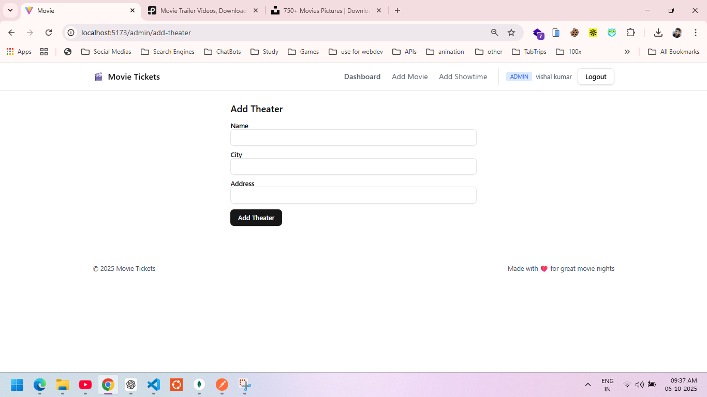
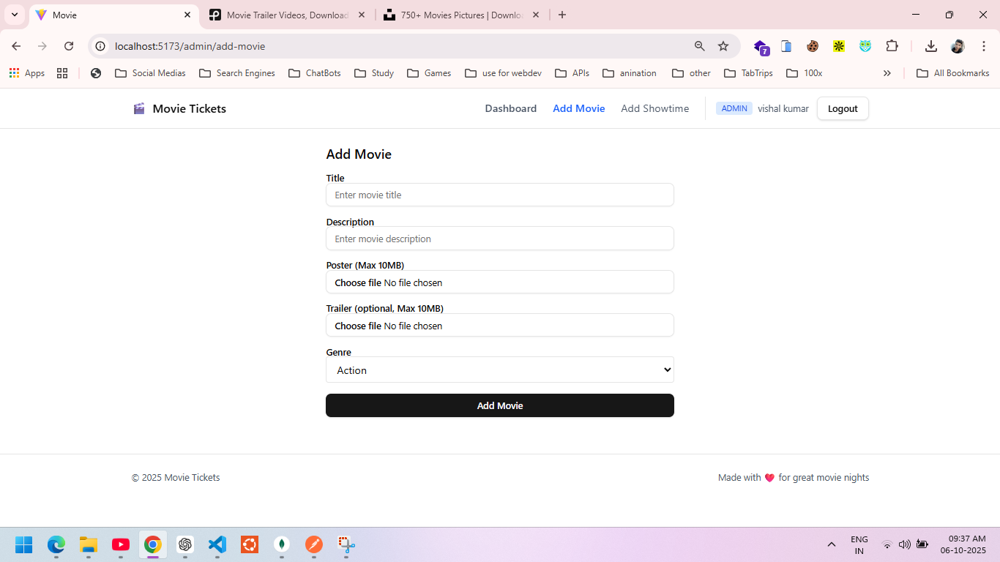
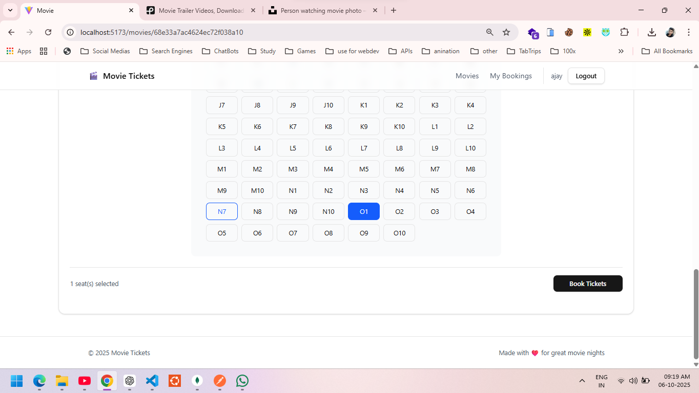
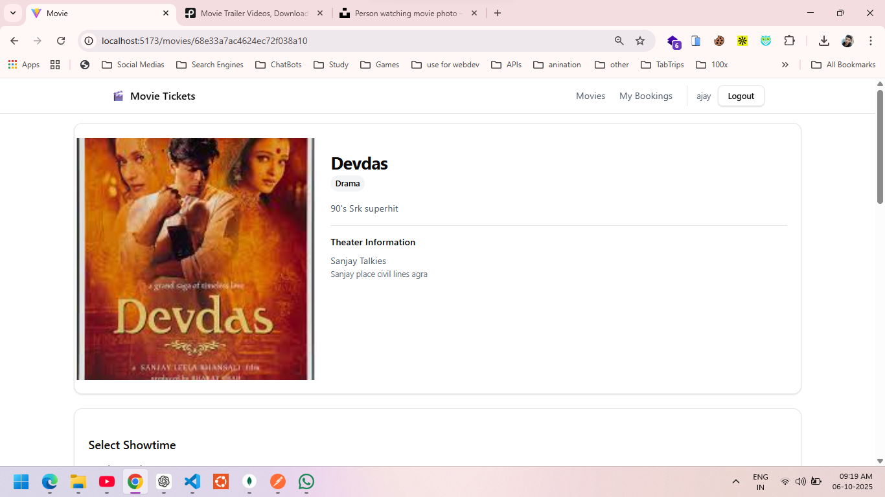
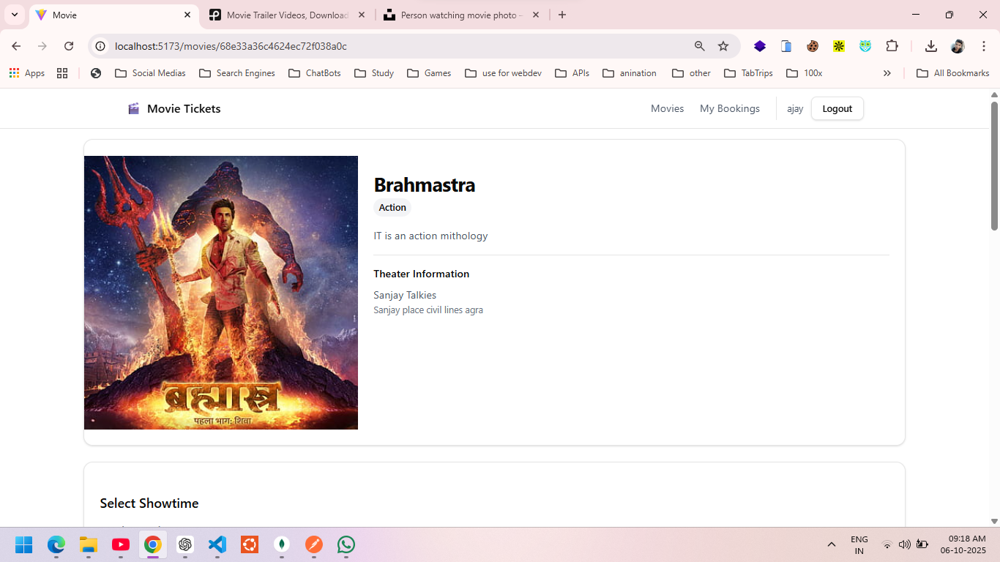
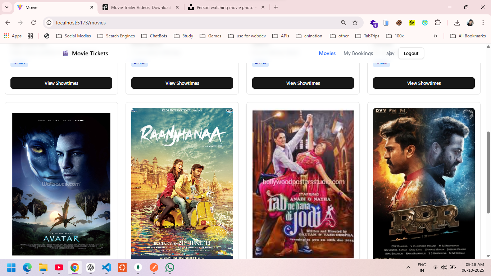
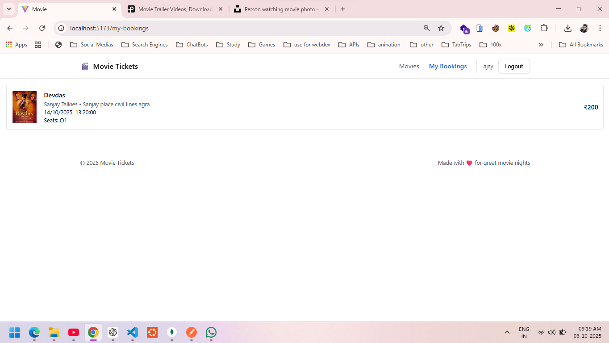
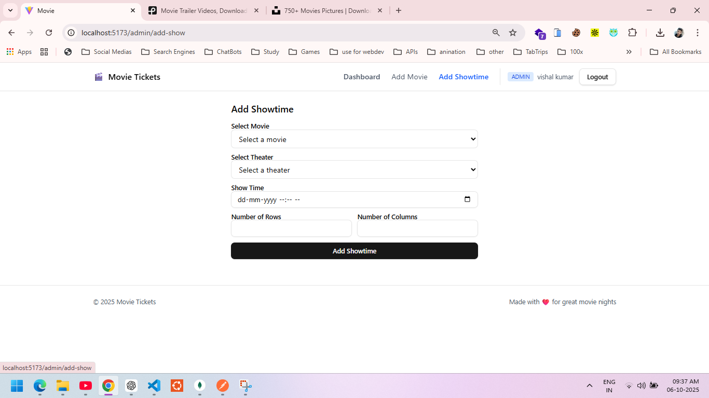

# Movie Ticket Booking System

Build and deploy a Movie Ticket Booking Web Application where users can log in securely, browse movies and showtimes, and book tickets. This project demonstrates full-stack development, secure authentication, and clean code structure.

---

## Tech Stack
- **Frontend:** React (functional components + hooks)
- **Backend:** Node.js + Express
- **Authentication:** JWT + bcrypt
- **Database:** MongoDB (can be switched to PostgreSQL)
- **Deployment:** Live hosting for both frontend and backend

---

## Features
- Secure user authentication (Signup & Login)
- Passwords securely hashed
- Browse movies (title, description, genre, showtimes)
- View available seats for a showtime
- Book tickets for selected showtime
- View booking history
- Good error handling & clean structure
- Prevent double-booking of seats

---

## Screenshots

Screenshots are located in the `assets` folder:










---

## Setup Instructions

### 1. Clone the repository
**GitHub Repository:** [https://github.com/Vishalkumar0412/Movie-ticket-app.git](https://github.com/Vishalkumar0412/Movie-ticket-app.git)

```bash
git clone https://github.com/Vishalkumar0412/Movie-ticket-app.git
cd Movie-ticket-app
```

### 2. Environment Variables
Create `.env` files for both frontend and backend:

#### Backend (`server/.env`)
```
PORT=3000
MONGO_URI=your_mongodb_connection_string
JWT_SECRET=your_jwt_secret
NODE_ENV=development
CLOUDINARY_CLOUD_NAME=your_cloudinary_cloud_name
CLOUDINARY_API_KEY=your_cloudinary_api_key
CLOUDINARY_API_SECRET=your_cloudinary_api_secret
FRONTEND_ORIGIN=http://localhost:5173
```

#### Frontend (`client/.env`)
```
VITE_API_BASE_URL=http://localhost:3000/api/v1
```

### 3. Install dependencies
```bash
# Backend
cd server
npm install

# Frontend
cd ../client
npm install
```

### 4. Run locally
```bash
# Backend
npm run dev

# Frontend
npm run dev
```

---

## Deployment Links
- **Frontend Live:** [Frontend URL here]
- **Backend API Live:** [Backend URL here]

---

## Test Users

### Admin
```
Email: admin@gmail.com
Password: Admin@123
```

### User
```
Email: user@gmail.com
Password: User@123
```

---

## API Endpoints (Backend)
- `POST /user/signup` - Signup
- `POST /user/login` - Login
- `GET /movie` - List movies
- `GET /movie/check-shows/:movieId` - Get showtimes for a movie
- `POST /booking/book-seat` - Book seats
- `GET /booking/my-bookings` - Get user's bookings
- `POST /user/logout` - Logout

---

## Bonus Features
- Responsive UI for mobile and desktop
- Admin dashboard for managing movies, theaters, and showtimes
- Error boundary and global error handling
- Loading spinners and skeleton loaders
- Password visibility toggle in forms

---

## Approach
- Used React hooks and context for state management and authentication
- Protected routes for user and admin access
- Clean separation of frontend and backend code
- MongoDB for flexible data modeling
- JWT for secure authentication
- Deployed both frontend and backend for live demo

---

---

## How to add screenshots
1. Save your screenshots in `client/src/assets/`
2. Reference them in the README as shown above

---

## Contact
For any queries, contact [your email here].


## Stack
- Frontend: React + Vite + TypeScript
- Backend: Node.js + Express + TypeScript  
- DB: MongoDB (Mongoose)
- Auth: JWT (httpOnly cookie), bcrypt

## Core Features
- User authentication with validation and secure password hashing
- Browse available movies and showtimes
- Interactive seat selection with atomic booking
- View booking history
- Responsive design

## Bonus Features
- TypeScript implementation for type safety
- Real-time seat availability updates
- Atomic transactions for booking multiple seats
- Enhanced security with httpOnly cookies
- Input validation and sanitization
- Error boundaries and loading states

## Local Setup

### Server
```bash
cd server
# Create .env file with:
PORT=3000
MONGO_URI=mongodb+srv://...
JWT_SECRET=your_jwt_secret
NODE_ENV=development
FRONTEND_ORIGIN=http://localhost:5173
SEAT_PRICE=200 # Optional, default is 200

npm install
npm run dev
```

### Client  
```bash
cd client
# Create .env file with:
VITE_API_BASE_URL=http://localhost:3000/api/v1

npm install
npm run dev
```

## API Endpoints
```
POST /api/v1/user/signup    # Register new user
POST /api/v1/user/login     # Login user
POST /api/v1/user/logout    # Logout user
GET  /api/v1/user          # Get user profile
GET  /api/v1/movie/fetch-movies  # List all movies
GET  /api/v1/movie/check-shows/:movieId  # Get showtimes
POST /api/v1/booking/book-seat  # Book seats
GET  /api/v1/booking/my    # View bookings
```

## Deployment
- Deploy server to any Node.js hosting platform
- Configure environment variables including CORS origin
- Deploy client and set API base URL
- Ensure CORS and credentials are properly configured

## Test Account
```
Email: admin@gmail.com
Password: Admin@123
```

```
Email: user@gmail.com
Password: User@123
```

## Important Notes
- Server requires credentials mode for cookies
- Client must use `credentials: 'include'` in fetch calls
- Seat price configurable via environment variable
